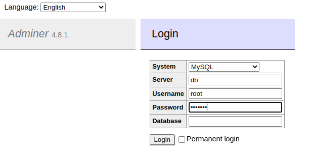

# MySQL 

MySQL is a [relational database management system (RDBMS)](../documentation/RDBMS.md).

## Docker images

- [mysql](https://hub.docker.com/_/mysql):8.0.32
- [adminer](https://hub.docker.com/_/adminer/):4.8.1 (database management tool)

## Ports

| Service       | Port |
| :------------ | :--- |
| MySQL (db)    | 3306 |
| adminer       | 8080 |

## Usage

Place yourself in this folder, configure your environment variables in [docker-compose.yml](./docker-compose.yml) and run

```bash
docker-compose up -d
```

Access Adminer at [http://[::]:8080/](http://[::]:8080/) and connect to your MySQL db :

- System : MySQL
- Server : "db" or as configured in docker-compose
- Username and password : "root" and `MYSQL_ROOT_PASSWORD` or `MYSQL_USER`  and `MYSQL_PASSWORD` if configured
- Database : Empty value or `MYSQL_DATABASE` if configured



## MySQL environment variables

| Variable                      | Description | Type |
| :---------------------------- | :---------- | :--- |
| `MYSQL_ROOT_PASSWORD`          | Root password | mandatory |
| `MYSQL_DATABASE`               | Database name | optional |
| `MYSQL_USER`                   | New user username (not root) | optional |
| `MYSQL_PASSWORD`               | New user password | optional |
| `MYSQL_ALLOW_EMPTY_PASSWORD`   | If set to `yes` will give superuser access to all | optional |
| `MYSQL_RANDOM_ROOT_PASSWORD`   | If set to `yes`, generates a random password for root user. Password printed on stdout after `GENERATED ROOT PASSWORD` | optional |
| `MYSQL_ONETIME_PASSWORD`       | Force root password change on firt login | optional |
| `MYSQL_INITDB_SKIP_TZINFO`     | If set to any value, disable timezone loading | optional |

## Tips

### Persist data

If you want to persist data on filesystem, uncomment the `volumes` section line 7 and 8

### MySQL available options

To see available options, run this command

```bash
docker run -it --rm mysql:8.0.32 --verbose --help
```

### Adminer

Adminer will connect to the container named db, if you want to change container name, update adminer docker-compose service env var `ADMINER_DEFAULT_SERVER`
