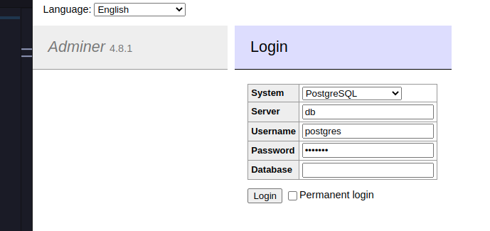

# PostgreSQL 

PostgreSQL is a [relational database management system (RDBMS)](../documentation/RDBMS.md).

## Docker images

- [postgresql](https://hub.docker.com/_/postgres):15.1
- [adminer](https://hub.docker.com/_/adminer/):4.8.1 (database management tool)

## Ports

| Service           | Port |
| :---------------- | :--- |
| PostgreSQL (db)   | 5432 |
| adminer           | 8080 |

## Database initialization

If you want the your initialization files to be executed, mount their directory as a volume in the `volumes` section of the [docker-compose.yml](./docker-compose.yml)

```yaml
        volumes:
          - /path/to/folder:/docker-entrypoint-initdb.d
```

Extract from PostgreSQL docker hub documentation :

```txt
the entrypoint calls initdb to create the default postgres user and database, it will
run any *.sql files, run any executable *.sh scripts, and source any
non-executable *.sh scripts found in that directory to do further
initialization before starting the service.

Warning: scripts in /docker-entrypoint-initdb.d are only run if you start
the container with a data directory that is empty
```

## Usage

Place yourself in this folder, configure your environment variables in [docker-compose.yml](./docker-compose.yml) and run

```bash
docker-compose up -d
```

Access Adminer at [http://[::]:8080/](http://[::]:8080/) and connect to your PostgreSQL db :

- System : PostgreSQL
- Server : "db" or as configured in docker-compose
- Username and password : "postgres" or `POSTGRES_USER` and `POSTGRES_PASSWORD`
- Database : Empty value or `POSTGRES_DB` if configured



## PostgreSQL environment variables

| Variable                    | Description                                                   | Type      |
| :-------------------------- | :------------------------------------------------------------ | :-------- |
| `POSTGRES_PASSWORD`         | `POSTGRES_USER` password                                      | mandatory |
| `POSTGRES_USER`             | Postgres user, if not specified will be `postgres` user       | optional  |
| `POSTGRES_DB`               | Database name                                                 | optional  |
| `POSTGRES_INITDB_ARGS`      | Used to send arguments to postgres initdb                     | optional  |
| `POSTGRES_INITDB_WALDIR`    | Change default loation of Postgres transaction log            | optional  |
| `POSTGRES_HOST_AUTH_METHOD` | Controls auth method                                          | optional  |
| `PGDATA`                    | Database files location, default : `/var/lib/postgresql/data` | optional  |

## Tips

### Persist data

If you want to persist data on filesystem, uncomment the `volumes` section line 7 and 8

### Open ports

If you want to access your database, uncomment the `volumes` section line 9 and 10

### Adminer

Adminer will connect to the container named db, if you want to change container name, update adminer docker-compose service env var `ADMINER_DEFAULT_SERVER`
