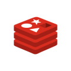

# Redis - Remote Dictionary Server 

Redis is an in-memory data structure store, used as a database, cache, and message broker.

Redis is a [NoSQL database](../documentation/NOSQL.md).

## Docker images

- [redis-stack](https://hub.docker.com/r/redis/redis-stack/tags):latest

Redis Stack contains both **Redis Stack Server** and Redis GUI named **Redis Insight**

## Ports

| Service               | Port |
| :-------------------- | :--- |
| Redis Stack Server    | 6379 |
| Redis Insight         | 8001 |

## Usage

Place yourself in this folder, configure your environment variables in [docker-compose.yml](./docker-compose.yml) and run

```bash
docker-compose up -d
```

Access Redis Insight at http://localhost:8001/

## Redis Stack environment variables

| Variable                        | Description                   | Type     |
| :------------------------------ | :---------------------------- | :------- |
| `REDIS_ARGS`                    | Extra arguments for Redis     | optional |
| `REDISEARCH_ARGS`               | arguments for RediSearch      | optional |
| `REDISJSON_ARGS`                | arguments for RedisJSON       | optional |
| `REDISGRAPH_ARGS`               | arguments for RedisGraph      | optional |
| `REDISTIMESERIES_ARGS`          | arguments for RedisTimeSeries | optional |
| `REDISBLOOM_ARGS`               | arguments for RedisBloom      | optional |

## Tips

### Find current configuration file example

If you want to customize Redis configuration, edit [custom-redis.conf](./custom-redis.conf) and uncomment configuration file volume at line 9 in [docker-compose.yml](./docker-compose.yml)

URL : https://redis.io/docs/management/config-file/

### Persist data

If you want to persist data on filesystem, uncomment the `volumes` section line 7 and 8

## Resources

- [Redis - Aws](https://aws.amazon.com/redis/)
- [Redis Docker install](https://redis.io/docs/stack/get-started/install/docker/)
- [RedisInsight Docker install](https://docs.redis.com/latest/ri/installing/install-docker/)